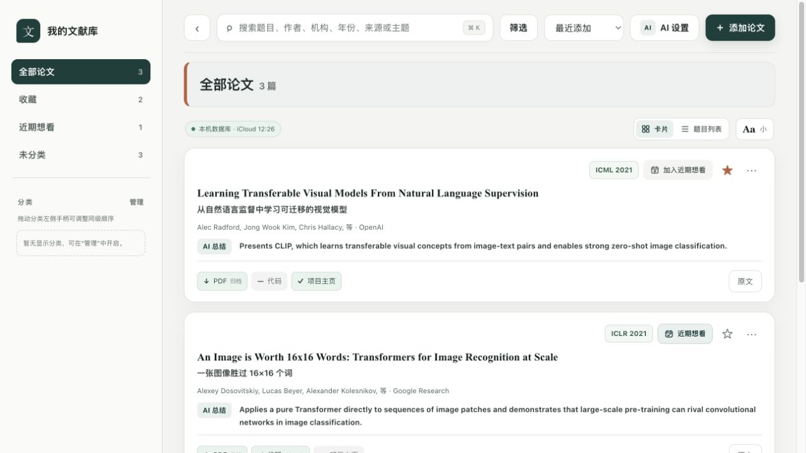

# Personal Literature Library

Personal Literature Library is a local-first workspace for collecting, organizing, and revisiting research papers. It combines a focused reading-library interface with hierarchical categories, paper-level notes, resource links, and optional AI-assisted enrichment—while keeping the library database on the user's machine.

The project is designed for individual research workflows. It is currently Chinese-first in the application interface; this README is maintained in English for public distribution.

## Highlights

- Search papers by title, author, institution, year, source, or topic.
- Organize papers in an optional three-level category hierarchy, with configurable sidebar visibility and drag-to-reorder controls.
- Switch between card and title-list views, adjust card text size, sort the library, and combine filters with favorites or a reading-later list.
- Keep original and Chinese titles, author and affiliation details, publication metadata, AI summaries, and personal notes together.
- Track paper resources consistently, including PDF availability, code repositories, project pages, and source links.
- Open locally archived PDFs first; on the first open, keep the source link responsive while archiving a verified local copy in the background.
- Detect duplicate papers using normalized titles and identifiers such as DOI and arXiv IDs.
- Add papers from a reference or URL, resolve metadata, and optionally enrich the draft with an AI model you configure.
- Store library data locally in SQLite and create integrity-checked backups after successful changes.

## Main Interface

<p align="center">
  
</p>

<p align="center"><em>Example interface using fictional, public paper records.</em></p>

## Requirements

- Node.js `>= 22.13.0`
- npm
- macOS is recommended for the complete experience: API credentials are stored in the macOS Keychain and the default backup location is iCloud Drive.

## Getting Started

Clone the repository, install dependencies, and start the local application:

```bash
npm ci
npm run dev
```

Open the local URL printed by the development server. The UI usually runs on `http://localhost:3000`; if that port is in use, Vite selects another available port.

The development command starts both services:

- the local library API on `http://127.0.0.1:4317`;
- the web application, configured to use that local API.

An empty library starts safely. A private local seed file, if present at `local-data/library-data.json`, is used only to initialize an empty database and is excluded from Git.

## Everyday Workflow

1. Create categories that match your research areas and choose which top-level categories appear in the sidebar.
2. Add a paper manually or provide a DOI, arXiv identifier, or paper URL for metadata lookup.
3. Review the proposed metadata, resource links, category assignment, and optional AI-generated summary before saving.
4. Use search, filters, favorites, and the reading-later list to retrieve papers quickly.
5. Add personal notes directly to a paper and use its PDF, code, project, or source links from the same card.

## AI-Assisted Enrichment

AI integration is optional. From **AI Settings**, add a service connection with a display name, base URL, API key, and one or more model IDs. A model is verified with a minimal request before it is saved, and a single service connection can share its credential across multiple models.

The application prefers the Responses API and falls back to Chat Completions only when a compatible provider explicitly returns a `404` for the first endpoint. AI requests respect the HTTP/HTTPS proxy available when the application starts.

### Credential Handling

- API keys are stored only in the macOS Keychain.
- API keys are not written to browser storage, SQLite, iCloud backups, environment files, or application logs.
- SQLite stores only connection metadata, model identifiers, verification timestamps, and active-model state.
- Base URLs must use HTTPS, except for local HTTP endpoints. URLs containing credentials, query strings, or fragments are rejected.

Do not add a real API key to a `.env` file, issue, pull request, or screenshot.

## Local Data and Backups

By default, the library database is stored in an application-specific directory under:

```text
~/Library/Application Support/
```

The default backup directory is in an application-specific directory under:

```text
~/Library/Mobile Documents/com~apple~CloudDocs/
```

For development or an alternate local setup, override the paths when starting the application:

```bash
LIBRARY_DB_PATH=/path/to/library.sqlite3 \
LIBRARY_BACKUP_DIR=/path/to/backups \
npm run dev
```

Backups are versioned and checked for SQLite integrity. If the backup location is unavailable, the local change remains saved and the application reports the backup issue.

### Local PDF Archive

PDFs are stored separately from SQLite. By default, verified local PDF copies are saved under:

```text
~/Library/Application Support/个人文献库/pdfs
```

Set `LIBRARY_PDF_DIR` to use another local directory. A paper card opens this local
copy when available; otherwise it opens the source URL immediately and starts a
background archive. HTML login pages, error pages, and files larger than 200 MiB
are rejected rather than saved as PDFs. The editor also supports retrying,
manual PDF import, and removal of the local copy.

PDF files are not embedded in SQLite or copied into each versioned SQLite backup.
Use Time Machine or a separate sync/backup strategy for the archive directory if
you need the PDF files on another device.

Personal library exports and local seed data are intentionally ignored by Git. Publishing this repository does not publish your papers, notes, credentials, or Zotero exports.

## Scripts

| Command | Purpose |
| --- | --- |
| `npm run dev` | Start the local API and web development server together. |
| `npm run dev:web` | Start only the web development server. |
| `npm run api` | Start only the local library API. |
| `npm run build` | Build the web application. |
| `npm run start` | Start the built web application. |
| `npm run lint` | Run ESLint. |
| `npm test` | Build the project and run the test suite. |

## Project Structure

```text
app/       React interface and global styling
lib/       Search, display, and publication-source utilities
scripts/   Local API, SQLite repository, AI services, and import helpers
tests/     Node.js test suite
worker/    Cloudflare worker entry point
docs/      Public project documentation and screenshots
```

## Verification

Before opening a pull request, run:

```bash
npm run lint
npm test
```

## Contributing

Contributions are welcome. Please keep pull requests focused, include tests for behavioral changes, and never commit private library data, generated backups, or credentials. For changes that affect persisted data, consider migration and backup compatibility.

## Security Notes

This is a local, single-user application—not a multi-tenant hosted service. Review any third-party AI provider's privacy terms before sending paper metadata or notes to it. Keep sensitive notes out of AI prompts unless that disclosure is appropriate for your use case.

## License

This project is licensed under the MIT License. See [LICENSE](LICENSE) for the full text.
