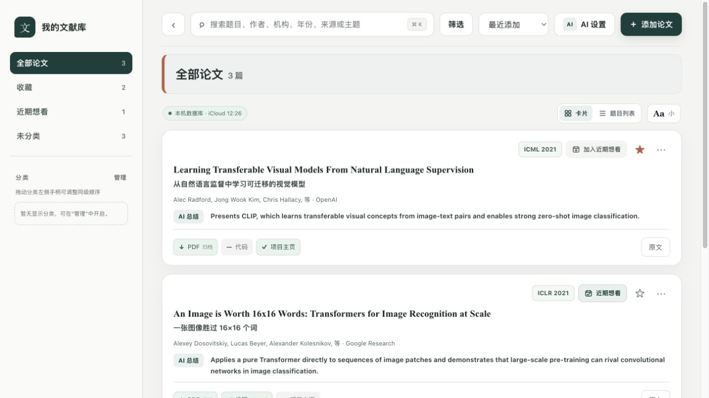

# Personal Literature Library

Personal Literature Library is a local-first workspace for collecting, organizing, and revisiting research papers. It combines a focused reading-library interface with hierarchical categories, paper-level notes, resource links, and optional AI-assisted enrichment—while keeping the library database on the user's machine.

The project is designed for individual research workflows. It is currently Chinese-first in the application interface; this README is maintained in English for public distribution.

## Highlights

- Search papers by title, author, institution, year, source, or topic.
- Organize papers in an optional three-level category hierarchy, with configurable sidebar visibility and drag-to-reorder controls.
- Switch between card and title-list views, adjust card text size, sort the library, and combine filters with favorites or a reading-later list.
- Keep original and Chinese titles, author and affiliation details, publication metadata, AI summaries, and personal notes together.
- Track paper resources consistently, including PDF availability, code repositories, project pages, and source links.
- Open locally archived PDFs first; on the first open, keep the source link responsive while archiving a verified local copy in the background.
- Detect duplicate papers using normalized titles and identifiers such as DOI and arXiv IDs.
- Discover recent papers with the AI Literature Radar, choose the number of candidates for each run, and review them before they enter the library.
- Give the configured AI a paper title, project page, repository, DOI, arXiv, PDF link, or natural-language clue; it searches the web and assembles an editable paper draft with clickable sources.
- Store library data locally in SQLite and create integrity-checked backups after successful changes.

## Main Interface

<p align="center">
  
</p>

<p align="center"><em>Example interface using fictional, public paper records.</em></p>

## Requirements

- Node.js `>= 22.13.0`
- npm
- macOS is recommended for the complete experience: API credentials are stored in the macOS Keychain and the default backup location is iCloud Drive.

## Getting Started

Clone the repository, install dependencies, and start the local application:

```bash
npm ci
npm run dev
```

Open the local URL printed by the development server. The UI usually runs on `http://localhost:3000`; if that port is in use, Vite selects another available port.

The development command starts both services:

- the local library API on `http://127.0.0.1:4317`;
- the web application, configured to use that local API.

An empty library starts safely. A private local seed file, if present at `local-data/library-data.json`, is used only to initialize an empty database and is excluded from Git.

## Everyday Workflow

1. Create categories that match your research areas and choose which top-level categories appear in the sidebar.
2. Run the Literature Radar when you want a batch of new candidates, or add a paper manually with a DOI, arXiv identifier, paper URL, or PDF URL.
3. Review the proposed metadata, resource links, category assignment, and optional AI-generated summary before saving.
4. Use search, filters, favorites, and the reading-later list to retrieve papers quickly.
5. Add personal notes directly to a paper and use its PDF, code, project, or source links from the same card.

## Literature Radar

The Literature Radar is a review queue for AI-assisted paper discovery. Each run is local-first and user-controlled:

1. Edit the research request and choose how many candidates to ask for (from 1 to 30).
2. The everyday request is editable inline. A separate advanced editor exposes the complete prompt template and its variables only when you open it, so the full system instructions do not clutter the normal workflow.
3. The configured AI model performs web search and returns only candidates with a DOI, arXiv identifier, or verifiable paper URL. The default template searches beyond arXiv and prioritizes formal venues such as ACM SIGGRAPH, SIGGRAPH Asia, ACM TOG, CVPR, ICCV, ECCV, Eurographics, Computer Graphics Forum, SCA, NeurIPS, ICLR, ICML, AAAI, TPAMI, IJCV, TVCG, and TIP when they match the research scope.
4. Before the request is sent, the AI receives a compact exclusion context containing paper titles, DOI/arXiv identifiers, and URLs from the current library and radar history. The local database then performs a second strict check against the library, pending candidates, added candidates, discarded history, and other results from the same run.
5. Candidates appear in **Personal Review**. **Discard and never recommend again** keeps a candidate in the permanent exclusion history; it can be restored to the review queue if you change your mind. If there are not enough high-confidence, non-duplicate results, the radar returns fewer papers instead of filling the quota with repeats.
6. **Review and add** opens the normal paper-intake flow with the candidate link prefilled. Metadata and duplicate checks run again, every field remains editable, and the radar item is marked as added only after you confirm a successful library save.

The **View this AI record** action shows and lets you copy the exact rendered prompts and complete AI responses for the latest run. This makes the search auditable without exposing the advanced template during everyday use.

## AI-Assisted Enrichment

AI integration is optional. From **AI Settings**, add a service connection with a display name, base URL, API key, and one or more model IDs. A model is verified with a minimal request before it is saved, and a single service connection can share its credential across multiple models.

Reasoning-capable models show a per-model **Reasoning effort** selector in AI Settings. The selected value is stored with that model and sent with subsequent Responses requests, so switching models also restores each model's chosen effort.

All AI provider requests use a 20-minute timeout, including model verification, enrichment, and web-search requests.

All configured service connections use streaming Responses (`/responses`), including model verification. They never fall back to Chat Completions after an error. A connection must support Responses; paper intake and radar additionally require its web-search tool. AI requests respect the HTTP/HTTPS proxy available when the application starts.

Transient Responses server errors, rate limits, network failures, and interrupted streams receive at most two retries with backoff within the original 20-minute request budget. Long `Retry-After` instructions are surfaced without an immediate retry. Authentication, quota, parameter, and unsupported-endpoint errors are not retried. Failures identify Responses, the upstream HTTP status when available, and the number of retries without exposing provider error bodies or credentials. A completed stream event returns immediately; partial text without a completion event is never treated as a finished result.

Paper intake and Literature Radar require a model and provider that support Responses API Web Search. Each AI request can wait up to 20 minutes. A model that only supports ordinary chat cannot perform paper intake in this mode; the UI reports configuration, unsupported-search, and timeout failures without silently generating facts from memory.

### AI Paper Intake

The input accepts up to 12,000 characters of titles, links, author information, abstracts, or other paper clues. The AI chooses its search strategy, identifies the paper, checks publication versions, and fills bibliographic information, a Chinese title and summary, up to three existing categories, and PDF/code/project links. The submitted clues and existing category paths are sent to the configured provider; credentials and library contents are not included in the research prompt.

The original input is passed unchanged to the configured model together with the fixed instructions in `scripts/prompts/paper-intake.txt` and the existing category paths. Every input follows the same AI request path, including titles, paper links, and GitHub repositories. The AI decides how to read links, identify the paper, follow up on incomplete searches, verify facts and sources, and fill the result. The local service does not classify the input, extract identifiers from it, or run a preliminary duplicate check.

Web-search requests expose the search tool with automatic tool selection. The fixed instructions require research, while the model can stop searching and produce its final answer. An empty final answer is reported separately from invalid paper JSON.

The local service parses the returned JSON and adapts it to an editable draft, retaining the AI's factual fields and listed sources without imposing field-by-field evidence gates or triggering another research request. Only basic data handling remains: a non-empty title for a usable draft, safe resource links, valid category IDs and identifiers, and a duplicate check on the identified paper. AI statuses for clarification, incomplete research, and no match are displayed directly, with the original input preserved for retry. Sources and metadata are AI-provided and should be reviewed before confirmation. Provider transport retries remain independent of this single research request.

Analysis never inserts a paper. Confirmation performs another duplicate check and saves to local SQLite with a backup. Search sources and the matching explanation are shown during review; the saved paper retains its resource URLs, not a permanent copy of the search transcript.

### Credential Handling

- API keys are stored only in the macOS Keychain.
- API keys are not written to browser storage, SQLite, iCloud backups, environment files, or application logs.
- SQLite stores only connection metadata, model identifiers, verification timestamps, and active-model state.
- Base URLs must use HTTPS, except for local HTTP endpoints. URLs containing credentials, query strings, or fragments are rejected.

Do not add a real API key to a `.env` file, issue, pull request, or screenshot.

## Local Data and Backups

By default, the library database is stored in an application-specific directory under:

```text
~/Library/Application Support/
```

The default backup directory is in an application-specific directory under:

```text
~/Library/Mobile Documents/com~apple~CloudDocs/
```

For development or an alternate local setup, override the paths when starting the application:

```bash
LIBRARY_DB_PATH=/path/to/library.sqlite3 \
LIBRARY_BACKUP_DIR=/path/to/backups \
npm run dev
```

Backups are versioned and checked for SQLite integrity. If the backup location is unavailable, the local change remains saved and the application reports the backup issue.

### Local PDF Archive

PDFs are stored separately from SQLite. By default, verified local PDF copies are saved under:

```text
~/Library/Application Support/个人文献库/pdfs
```

Set `LIBRARY_PDF_DIR` to use another local directory. A paper card opens this local
copy when available; otherwise it opens the source URL immediately and starts a
background archive. HTML login pages, error pages, and files larger than 200 MiB
are rejected rather than saved as PDFs. The editor also supports retrying,
manual PDF import, and removal of the local copy.

PDF and publisher ePDF links can be passed directly to the AI as research clues.
The model looks for a matching paper page or accessible copy; successful identification
is not guaranteed for inaccessible files. Intake does not itself download or parse a
PDF or imply that the model read its full text. Local PDF archiving remains a separate
action after the paper has been saved.

PDF files are not embedded in SQLite or copied into each versioned SQLite backup.
Use Time Machine or a separate sync/backup strategy for the archive directory if
you need the PDF files on another device.

Personal library exports and local seed data are intentionally ignored by Git. Publishing this repository does not publish your papers, notes, credentials, or Zotero exports.

## Scripts

| Command | Purpose |
| --- | --- |
| `npm run dev` | Start the local API and web development server together. |
| `npm run dev:web` | Start only the web development server. |
| `npm run api` | Start only the local library API. |
| `npm run build` | Build the web application. |
| `npm run start` | Start the built web application. |
| `npm run lint` | Run ESLint. |
| `npm test` | Build the project and run the test suite. |

## Project Structure

```text
app/       React interface and global styling
lib/       Search, display, and publication-source utilities
scripts/   Local API, SQLite repository, AI services, and import helpers
tests/     Node.js test suite
worker/    Cloudflare worker entry point
docs/      Public project documentation and screenshots
```

## Verification

Before opening a pull request, run:

```bash
npm run lint
npm test
```

## Contributing

Contributions are welcome. Please keep pull requests focused, include tests for behavioral changes, and never commit private library data, generated backups, or credentials. For changes that affect persisted data, consider migration and backup compatibility.

## Security Notes

This is a local, single-user application—not a multi-tenant hosted service. Review any third-party AI provider's privacy terms before sending paper metadata or notes to it. Keep sensitive notes out of AI prompts unless that disclosure is appropriate for your use case.

## License

This project is licensed under the MIT License. See [LICENSE](LICENSE) for the full text.
